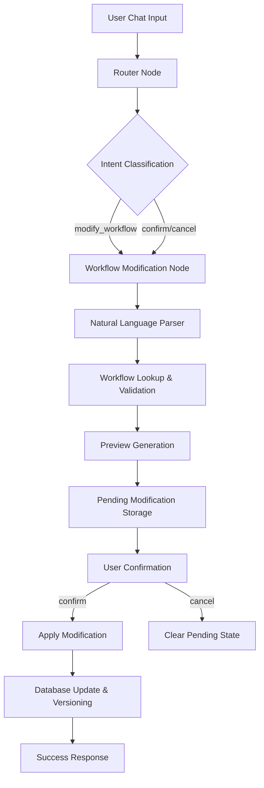

# KCC Workflow Modification System - Architecture Documentation

## Overview

The KCC Workflow Modification System is a production-grade, modular system that enables dynamic modification of banking workflows through natural language prompts. It provides a complete end-to-end solution with preview generation, confirmation flows, and persistent database storage.

## System Architecture



## Core Components

### 1. LangGraph Agent Nodes

#### Router Node (`router_node`)
**Location**: `app/agents/supervisor.py:53-120`

**Purpose**: Intent classification and context extraction from user messages

**Key Functions**:
- Extracts JSON payloads from user messages using regex pattern matching
- Classifies user intents (workflow execution, modification, confirmation)
- Routes requests to appropriate specialized nodes
- Maintains conversation state and context

**State Management**:
```python
# Extracts and stores context in agent state
state['workflow_context'] = extracted_json
state['bank_name'] = bank
state['product_name'] = product
```

**Routing Logic**:
- `continue {action: "modify_workflow"}` → `workflow_modification`
- `confirm` or `cancel` → `workflow_modification` 
- `continue {action: "start_workflow"}` → `workflow_execution`
- Default questions → `general_qa`

#### Workflow Modification Node (`workflow_modification_node`)
**Location**: `app/agents/supervisor.py:1675-1814`

**Purpose**: Handles complete workflow modification lifecycle

**Core Responsibilities**:
1. **Parameter Extraction & Validation**
2. **Natural Language Processing** 
3. **Workflow Preview Generation**
4. **Confirmation Flow Management**
5. **Database Persistence**

**State Flow**:
```python
def workflow_modification_node(state: AgentState):
    # 1. Extract parameters from state and user query
    user_id, conversation_id, user_query = _extract_modification_parameters(state)
    
    # 2. Handle confirmation/cancellation
    if user_query.lower() in ['confirm', 'cancel']:
        return handle_workflow_confirmation(state, user_id, confirm=(user_query.lower() == 'confirm'))
    
    # 3. Parse natural language modification request
    parsed_request = _parse_modification_request(user_query)
    
    # 4. Generate workflow preview
    preview_data = _generate_workflow_preview(bank, product, parsed_request)
    
    # 5. Store pending modification
    _store_pending_modification(conversation_id, user_id, bank, product, preview_data)
    
    # 6. Return preview with confirmation prompt
    return {"response": preview_response}
```

### 2. Helper Functions (Modular Architecture)

#### Natural Language Parser (`_parse_modification_request`)
**Location**: `app/agents/supervisor.py:1827-1870`

**Purpose**: Converts natural language to structured modification commands

**Algorithm**:
```python
def _parse_modification_request(request: str) -> dict:
    # 1. Use OpenAI LLM to parse natural language
    # 2. Extract source action, target action, and direction
    # 3. Return structured format: {source, target, direction}
    
    # Example: "move aadhar-verification before verify-otp"
    # Returns: {
    #     "source": "aadhar-verification",
    #     "target": "verify-otp", 
    #     "direction": "before"
    # }
```

#### Workflow Preview Generator (`_generate_workflow_preview`)
**Location**: `app/agents/supervisor.py:1871-1934`

**Purpose**: Creates before/after workflow sequence comparison

**Process**:
1. **Workflow Lookup**: Retrieves current workflow from database
2. **Action Validation**: Fuzzy matching for action IDs
3. **Sequence Reordering**: Applies modification logic
4. **Description Preservation**: Maintains all action descriptions
5. **Preview Formatting**: Creates structured comparison

**Output Structure**:
```json
{
  "current_sequence": {
    "bank": "federal",
    "product": "kcc", 
    "version": 1,
    "sequence": [
      {
        "step": 1,
        "action_id": "kcc-welcome",
        "stage_name": "KCC Welcome Screen",
        "description": "Initial welcome screen..."
      }
    ]
  },
  "proposed_sequence": [...],
  "confirmation_prompt": "✅ Reply 'confirm' to apply..."
}
```

#### Confirmation Handler (`handle_workflow_confirmation`)
**Location**: `app/agents/supervisor.py:1988-2040`

**Purpose**: Processes user confirmation or cancellation

**Confirmation Flow**:
```python
def handle_workflow_confirmation(state: AgentState, user_id: str, confirm: bool):
    # 1. Retrieve pending modification from database
    pending_mod = get_pending_workflow_modification(conversation_id, user_id)
    
    if confirm:
        # 2a. Apply modification to database
        success = _apply_workflow_modification(pending_mod)
        # 2b. Clear pending state
        clear_pending_workflow_modification(conversation_id, user_id)
        # 2c. Return success message
    else:
        # 3a. Clear pending state without applying
        clear_pending_workflow_modification(conversation_id, user_id)
        # 3b. Return cancellation message
```

### 3. Database Layer (`app/core/database.py`)

#### Database Models

##### PendingWorkflowModification Model
**Location**: `app/core/database.py:104-115`

```python
class PendingWorkflowModification(Base):
    __tablename__ = "pending_workflow_modifications"
    id = Column(PG_UUID(as_uuid=True), primary_key=True, default=uuid.uuid4)
    conversation_id = Column(PG_UUID(as_uuid=True), ForeignKey("conversations.id"), nullable=False, index=True)
    user_id = Column(String, nullable=False)
    bank = Column(String, nullable=False)
    product = Column(String, nullable=False)
    modification_data = Column(JSON, nullable=False)  # Stores complete modification details
    created_at = Column(DateTime, default=datetime.utcnow)
```

**Purpose**: Persistent storage for pending workflow modifications across server restarts

##### Workflow Model
**Location**: `app/core/database.py:82-95`

```python
class Workflow(Base):
    __tablename__ = "workflows"
    id = Column(PG_UUID(as_uuid=True), primary_key=True, default=uuid.uuid4)
    bank = Column(String, nullable=False)
    product = Column(String, nullable=False)
    version = Column(Integer, nullable=False, default=1)
    action_schema = Column(JSON, nullable=False)
    deleted_at = Column(DateTime, nullable=True)  # Soft delete for versioning
    modified_by = Column(String, nullable=True)
    modification_reason = Column(String, nullable=True)
    created_at = Column(DateTime, default=datetime.utcnow)
```

**Purpose**: Versioned storage of workflow definitions with soft delete pattern

#### Database Functions

##### Pending Modification Management

**Store Pending Modification** (`store_pending_workflow_modification`)
**Location**: `app/core/database.py:435-460`

```python
def store_pending_workflow_modification(conversation_id: str, user_id: str, bank: str, product: str, modification_data: dict) -> bool:
    # 1. Convert conversation_id to UUID
    # 2. Clear any existing pending modifications for this conversation
    # 3. Create new pending modification record
    # 4. Store in database with complete modification details
```

**Retrieve Pending Modification** (`get_pending_workflow_modification`)
**Location**: `app/core/database.py:474-502`

```python
def get_pending_workflow_modification(conversation_id: str, user_id: str) -> dict:
    # 1. Query database for pending modification
    # 2. Return complete record structure including:
    #    - Database columns: id, conversation_id, user_id, bank, product, created_at
    #    - Modification data: new_schema, modification_request, modification_plan
```

**Clear Pending Modification** (`clear_pending_workflow_modification`)
**Location**: `app/core/database.py:504-520`

```python
def clear_pending_workflow_modification(conversation_id: str, user_id: str) -> bool:
    # 1. Find and delete pending modification record
    # 2. Commit transaction
    # 3. Return success status
```

##### Workflow Management

**Create Modified Workflow** (`create_modified_workflow`)
**Location**: `app/core/database.py:267-292`

```python
def create_modified_workflow(bank: str, product: str, new_action_schema: list, modification_reason: str, modified_by: str) -> bool:
    # 1. Soft delete current workflow (set deleted_at timestamp)
    # 2. Increment version number
    # 3. Create new workflow record with modified schema
    # 4. Maintain audit trail with modification_reason and modified_by
```

## State Management Architecture

### 1. LangGraph Agent State

**State Structure** (`AgentState`):
```python
class AgentState(TypedDict):
    user_id: str
    conversation_id: str
    user_query: str
    chat_history: List[ChatMessage]
    bank_name: Optional[str]
    product_name: Optional[str]
    workflow_context: Optional[dict]
    response: Optional[dict]
```

**State Flow**:
1. **Router Node**: Extracts context and populates state
2. **Modification Node**: Reads state, processes request, updates response
3. **Database Layer**: Persists state across API calls

### 2. Database State Persistence

**Session Management**:
- Each conversation has a unique `conversation_id` (UUID)
- Pending modifications linked to conversation for persistence
- State survives server restarts through database storage

**Context Preservation**:
```python
# Context stored in multiple layers:
# 1. Agent State (in-memory during request)
state['workflow_context'] = {
    "action": "modify_workflow",
    "bank": "federal", 
    "product": "kcc",
    "request": "move aadhar-verification before verify-otp"
}

# 2. Database (persistent across requests)
pending_modification = {
    "conversation_id": "uuid",
    "user_id": "user123",
    "bank": "federal",
    "product": "kcc", 
    "modification_data": {
        "modification_request": "move aadhar-verification before verify-otp",
        "new_schema": [...],
        "modification_plan": {...}
    }
}
```

### 3. Chat History Integration

**Chat Message Storage** (`ChatMessage` model):
```python
class ChatMessage(Base):
    id = Column(PG_UUID(as_uuid=True), primary_key=True, default=uuid.uuid4)
    conversation_id = Column(PG_UUID(as_uuid=True), ForeignKey("conversations.id"), nullable=False)
    sender_type = Column(Enum(SenderType), nullable=False)  # USER or ASSISTANT
    content = Column(Text, nullable=False)
    timestamp = Column(DateTime, default=datetime.utcnow)
```

**Context Building Process**:
1. **Load Chat History**: Retrieve last N messages from database
2. **Format for LangGraph**: Convert to LangChain message format
3. **Maintain Context**: Pass history through agent state
4. **Update History**: Store new messages after processing

## Context Management in Detail

### 1. Request Context Extraction

**JSON Payload Parsing** (Router Node):
```python
# Pattern matching for structured requests
json_pattern = r'\{.*\}'
match = re.search(json_pattern, user_query, re.DOTALL)

if match:
    json_str = match.group()
    context = json.loads(json_str)
    # Extract: action, bank, product, request parameters
```

**Natural Language Processing** (Modification Node):
```python
# LLM-based parsing for natural language requests
llm_prompt = f"""
Parse this workflow modification request: "{request}"
Extract:
- source_action: which action to move
- target_action: reference action for positioning  
- direction: "before" or "after"
"""
```

### 2. Workflow Context Building

**Current Workflow Retrieval**:
```python
def get_current_workflow(bank: str, product: str) -> dict:
    # 1. Query database for active workflow (deleted_at IS NULL)
    # 2. Return complete workflow schema with:
    #    - Metadata: bank, product, version
    #    - Action sequence: ordered list of workflow steps
    #    - Descriptions: preserved from original schema
```

**Action Validation & Fuzzy Matching**:
```python
def validate_and_match_actions(workflow_actions: list, source: str, target: str) -> tuple:
    # 1. Extract all action IDs from workflow
    # 2. Fuzzy match source and target against available actions
    # 3. Return matched action IDs or raise validation errors
```

### 3. Modification Context Generation

**Workflow Reordering Logic**:
```python
def reorder_workflow_sequence(current_sequence: list, source_action: str, target_action: str, direction: str) -> list:
    # 1. Find source and target positions in current sequence
    # 2. Remove source action from current position
    # 3. Insert source action at new position (before/after target)
    # 4. Recalculate step numbers
    # 5. Preserve all action descriptions and metadata
```

**Preview Context Assembly**:
```python
preview_context = {
    "modification_request": original_request,
    "current_sequence": {
        "bank": bank,
        "product": product,
        "version": current_version,
        "sequence": current_workflow_steps
    },
    "proposed_sequence": reordered_workflow_steps,
    "modification_plan": {
        "source_action": matched_source,
        "target_action": matched_target,
        "direction": direction,
        "changes_summary": "Moved X before Y"
    }
}
```

## Error Handling & Production Features

### 1. Comprehensive Error Handling

**Validation Errors**:
- Missing required parameters
- Invalid bank/product combinations
- Non-existent action IDs
- Malformed natural language requests

**Database Errors**:
- Connection failures
- Transaction rollbacks
- UUID conversion errors
- Constraint violations

**State Management Errors**:
- Missing conversation context
- Expired pending modifications
- Concurrent modification conflicts

### 2. Logging & Debugging

**Debug Logging**:
```python
print(f"🔍 MODIFICATION: Processing request for user: {user_id}")
print(f"🔍 MODIFICATION: Parsed request: {parsed_request}")
print(f"🔍 MODIFICATION: Current workflow: {current_workflow}")
print(f"🔍 MODIFICATION: Generated preview: {preview_data}")
```

**Error Tracing**:
```python
except Exception as e:
    import traceback
    print(f"❌ Error in workflow modification: {e}")
    print(f"📋 Full traceback: {traceback.format_exc()}")
```

### 3. Production Safeguards

**Data Integrity**:
- Database transactions for atomic operations
- Soft delete pattern for workflow versioning
- Foreign key constraints for referential integrity

**Concurrency Handling**:
- Conversation-scoped pending modifications
- User-specific modification locks
- Timestamp-based conflict resolution

**Scalability Features**:
- Modular architecture for easy extension
- Database indexing on frequently queried columns
- Efficient JSON storage for flexible schema evolution

## Usage Examples

### 1. Basic Workflow Modification

**Request**:
```json
{
  "action": "modify_workflow",
  "bank": "federal", 
  "product": "kcc",
  "request": "move aadhar-verification before verify-otp"
}
```

**System Response**:
1. Parses natural language request
2. Generates before/after preview
3. Stores pending modification in database
4. Returns preview with confirmation prompt

**User Confirmation**:
```
User: "confirm"
System: "✅ Successfully applied workflow modification for federal kcc!"
```

### 2. Complex Reordering

**Request**:
```json
{
  "action": "modify_workflow",
  "bank": "sbi",
  "product": "kcc", 
  "request": "put customer-photo after applicant-details and before residence-details"
}
```

**System Processing**:
1. Identifies multiple positioning constraints
2. Calculates optimal insertion point
3. Validates sequence integrity
4. Generates comprehensive preview

### 3. Error Scenarios

**Invalid Action ID**:
```
Request: "move invalid-action before verify-otp"
Response: "❌ Action 'invalid-action' not found in workflow"
```

**Missing Workflow**:
```
Request: "modify workflow for nonexistent-bank"
Response: "❌ No workflow found for bank: nonexistent-bank, product: kcc"
```

## Future Enhancements

### 1. Advanced Natural Language Processing
- Support for complex multi-step modifications
- Conditional workflow changes
- Bulk modification operations

### 2. Enhanced Validation
- Business rule validation
- Workflow dependency checking
- Impact analysis for modifications

### 3. Audit & Compliance
- Complete modification audit trails
- Rollback capabilities
- Approval workflows for sensitive changes

### 4. Performance Optimizations
- Caching for frequently accessed workflows
- Batch modification processing
- Asynchronous preview generation

---

This architecture provides a robust, scalable, and maintainable foundation for dynamic workflow modification with full state persistence, comprehensive error handling, and production-ready reliability.
